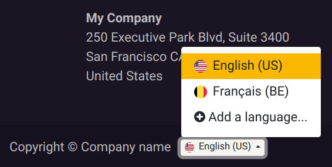

===============
Change language
===============

Your database's language is selected upon its creation. However, you can :ref:`add <language/add>`
and :ref:`install <language/install>` additional languages to allow users to manage their database
in another language or to :doc:`translate <../../websites/website/configuration/translate>` your
website.

.. _language/add:

Add languages
=============

You can download additional languages by going to :menuselection:`My profile` and clicking on the
:icon:`fa-globe` (:guilabel:`globe`) icon next to the :guilabel:`Language` field, or from your
dashboard, by going to the **Settings** app, :guilabel:`Languages` section, and clicking
:guilabel:`Add Languages`. Select the languages you want from the dropdown menu.

Ticking the :guilabel:`Websites to translate` checkboxes allows users to change your website's
navigation to another language using the :ref:`language selector <translate/language-selector>`. As
an admin, this also enables you to :guilabel:`Add a language` from your website.

.. tip::
   You might have to refresh your page to see the new language.

.. _language/install:

Change language
===============

Users of your database can choose their favorite language by going to :menuselection:`My profile -->
Preferences --> Language`.

.. tip::
   You can decide to send emails and documents to a contact into any previously installed language.
   To do so, go to **Settings** app, :guilabel:`Users` section, and click :guilabel:`Manage Users`.
   Select a user, go to the :guilabel:`Preferences` tab, and select the :guilabel:`Language` you
   want.
