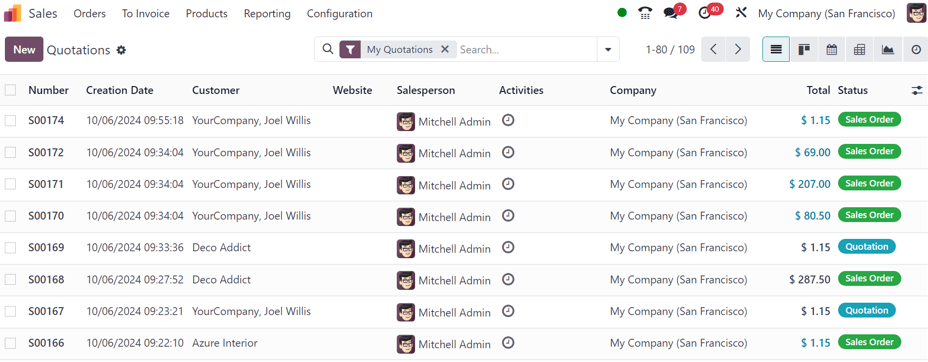
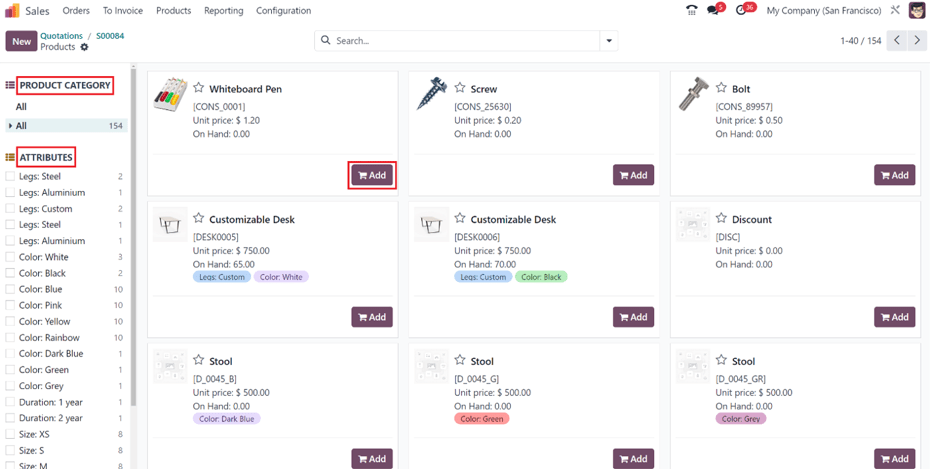
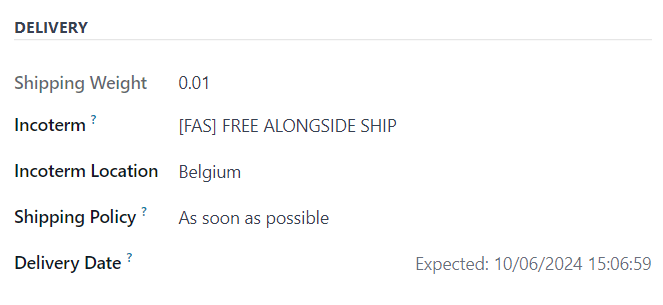
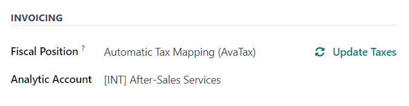
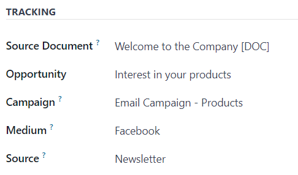

=================
Create quotations
=================

In Odoo *Sales* quotations can be quickly created and sent to customers. Once a quotation has been
confirmed, it officially turns into a *sales order*, which can then be invoiced and paid for.

Quotation settings
==================

While the ability to create and send quotations in the Odoo *Sales* application is avaialble, by
default, there are a collection of quotation and order settings that can be customized and
configured, if needed.

To access these setting options, navigate to :menuselection:`Sales app --> Configuration -->
Settings`, and scroll to the :guilabel:`Quotations & Orders` section.

.. image:: create_quotations/quotations-orders-section.png
   :align: center
   :alt: The Quotations and Orders section on the Odoo Sales app Settings page.

- :guilabel:`Quotation Templates`: create unique quotation templates featuring standardized offers
  with default products, which can be easily accessed from a quotation form. When this checkbox is
  ticked, an additional field, :guilabel:`Default Template` appears, along with a link to the
  :guilabel:`Quotation Templates` page. To learn more, refer to the :doc:`Quotation templates
  <quote_template>` documentation.
- :guilabel:`Online Signature`: request an online signature to confirm orders. To learn more, refer
  to the :doc:`Online payment order confirmation <get_signature_to_validate>` documentation.
- :guilabel:`Online Payment`: request an online prepayment from customers to confirm orders. Request
  a full payment or paritial payment (via down payment). When this checkbox is ticked, an additional
  field, :guilabel:`Prepayment amount (%)`, appears. There is also a link to the :guilabel:`Payment
  Providers` page, as well. To learn more, refer to the :doc:`Online payment order confirmation
  <get_paid_to_validate>` documentation.
- :guilabel:`Default Quotation Validity`: determine an amount (in :guilabel:`days`) that quotations
  can remain valid for, by default.
- :guilabel:`Default Recurrence`: determine a default period from the drop-down menu to use as a
  recurrence for a new quotation.
- :guilabel:`Sale Warnings`: get warnings in orders for specific products or customers.
- :guilabel:`PDF Quote builder`: customize the look of quotations with unique header pages, product
  descriptions, footer pages, and more. To learn more, refer to the :doc:`PDF quote builder
  <pdf_quote_builder>` documentation.
- :guilabel:`Lock Confirmed Sales`: ensure that no further edits can be made to confirmed orders.
- :guilabel:`Pro-Forma Invoice`: send pro-forma invoices to customers. To learn more, refer to the
  :doc:`Pro-forma invoices <../invoicing/proforma>` documentation.

To activate any of these settings, tick the checkbox beside the desired option(s). Then, click
:guilabel:`Save`.

Quotations dashboard
====================

To access the *Quotations* dashboard, which is the default dashboard of the *Sales* app, simply
click the :menuselection:`Sales app` from the main Odoo dashbord.

.. tip::
   If already in the *Sales* application, the :guilabel:`Quotations` dashboard can be accessed by
   navigating to :menuselection:`Orders --> Quotations` from the header menu in the *Sales*
   application.

By default, the :guilabel:`Quotations` dashboard displays all the quotations in the database that
are related to the current user, as indicated by the default :guilabel:`My Quotations` filter
present in the :guilabel:`Search...` bar.

.. note::
   To view *all* quotations in the database, remove the :guilabel:`My Quotations` filter from the
   :guilabel:`Search...` bar.

Quotations on this page appear in a default list view, but can also be viewed in a
:icon:`oi-view-kanban` :guilabel:`Kanban` view, :icon:`fa-calendar` :guilabel:`Calendar`,
:icon:`oi-view-pivot` :guilabel:`Pivot` table, :icon:`fa-area-chart` :guilabel:`Graph`, or
:icon:`fa-clock-o` :guilabel:`Activity` view.

To view and/or modify any listed quotation from the :guilabel:`Quotations` dashboard, simply click
on the desired quotation line from the list, and Odoo reveals the specific form for that selected
quotation.

Create quotation
================

To create a quotation in the Odoo *Sales* application, open the :menuselection:`Sales app`, and
click the :guilabel:`New` button, located in the upper-left corner of the main
:guilabel:`Quotations` dashboard.

.. important::
   The :guilabel:`New` button is **only** present if the :guilabel:`Quotations` dashboard is in list
   or Kanban view.

Clicking the :guilabel:`New` button reveals a blank quotation form, with various fields and tabs to
configure.

.. image:: create_quotations/quotation-form.png
   :align: center
   :alt: A typical quotation form in the Odoo Sales application.

Begin by entering the customer's name in the :guilabel:`Customer` field at the top of the form. This
is a **required** field.

If the customer's information is already in the database, the :guilabel:`Invoice Address` and
:guilabel:`Delivery Address` fields auto-populate with the saved information for those respective
fields, based on the data from that customer's contact record (found in the *Contacts* application).

If the customer was referred by another customer or contact, enter their name in the
:guilabel:`Referrer` field.

If a :guilabel:`Referrer` is selected, a new field, :guilabel:`Commission Plan` appears, in which
a commission can be selected from the drop-down menu that would be rewarded to the contact selected
in the :guilabel:`Referrer` field.

Next, if they have not already been auto-populated with the customer's information, enter the
appropriate addresses in the :guilabel:`Invoice Address` and :guilabel:`Delivery Address` fields.
Both of these fields are **required**.

Then, if desired, choose a :guilabel:`Quotation Template` from the drop-down field to apply to this
quotation.

The date that appears, by default, in the :guilabel:`Expiration` field is based on the number
configured in the :guilabel:`Default Quotation Validity` setting (in :menuselection:`Sales app -->
Configuration --> Settings`).

.. tip::
   When using a quotation template, the date in the :guilabel:`Expiration` field is based off the
   :guilabel:`Quotation Validity` figure on the template form.

If this quotation for a recurring product or subscription, select the desired :guilabel:`Recurring
Plan` from that specific drop-down menu.

If desired, select a specific :guilabel:`Pricelist` to be applied to this quotation.

Lastly, select any specific :guilabel:`Payment Terms` to be used for this quotation.

Order Lines tab
---------------

The first tab on the quotation form is the :guilabel:`Order Lines` tab.

In this tab, select products, and quantities of those products, to add them to the quotation.

There are two ways to add products to the quotation from this tab.

Clicking :guilabel:`Add a product`, selecting the desired item from the :guilabel:`Product`
drop-down field, and proceeding to adjust the quantity of that selected product, if necessary, is
one way to add products to a quotation.

Or, click :guilabel:`Catalog` to reveal a separate page, showcasing every item (and every potential
product variant) in a neatly organized display, with items organziable by :guilabel:`Product
Category` and :guilabel:`Attributes`.

From here, simply locate the desired items, click the :icon:`fa-shopping-cart` :guilabel:`Add`
button on the product card(s), and adjust the quantity, if needed. When complete, click the
:guilabel:`Back to Quotation` button in the upper-left corner to return to the quotation, where the
newly-selected catalog items can be found in the :guilabel:`Order Lines` tab.

If multiple items should be presented in a more organized way on the quotation, click :guilabel:`Add
a section`, enter a name for the section, and drag-and-drop that section heading in the desired
location amongst the items in the :guilabel:`Order Lines` tab. The section heading appears in bold.

If needed, click :guilabel:`Add a note` beneath a certain product line, to add a custom note about
that specific product. The note appears in italics.

Beneath the product lines, there are buttons that can be clicked to apply any of the following:
:guilabel:`Coupon Code`, :guilabel:`Promotions`, :guilabel:`Discount`, and/or :guilabel:`Add
shipping`.

.. seealso::
   - :doc:`../products_prices/ewallets_giftcards`
   - :doc:`../products_prices/loyalty_discount`
   - :doc:`../products_prices/prices/pricing`

Optional Products tab
---------------------

Open the :guilabel:`Optional Products` tab to select related products that can be presented to the
customer, which may result in an increased sale. For example, if the customer wants to buy a car, an
optional product that could be offered is a *Trailer Hitch*.

To learn more about the :guilabel:`Optional Products` tab on a quotation, refer to the
:doc:`Optional products <optional_products>` documentation.

Other Info tab
--------------

In the :guilabel:`Other Info` tab, there are various quotation-related configurations separated into
four different sections: :guilabel:`Sales`, :guilabel:`Delivery`, :guilabel:`Invoicing`,
:guilabel:`Tracking`.

.. note::
   Some fields only appear if specific settings and options have been configured.

Sales section
~~~~~~~~~~~~~

In the :guilabel:`Sales` section of the :guilabel:`Other Info` tab, there are sales specific fields
that can be configured.

.. image:: create_quotations/other-info-sales.png
   :align: center
   :alt: The Sales section of the Other Info tab of a quotation form in Odoo Sales.

- :guilabel:`Salesperson`: assign a salesperson from the drop-down menu to be associated with this
  quotation. The user who originally created the quotation is selected in this field, by default.
- :guilabel:`Sales Team`: assign a specific sales team to this quotation. If the selected
  :guilabel:`Salesperson` is a member of a sales team, that team is auto-populated in the field.
- :guilabel:`Company`: select a company from the drop-down menu that this quotation should be
  associated with. This field only appears when working in a multi-company environment.
- :guilabel:`Online signature`: tick this checkbox to request an online signature from the customer
  to confirm the order. This field only appears if the *Online Signature* setting has been enabled.
- :guilabel:`Online payment`: tick this checkbox, and enter a desired percentage in the adjacent
  field, in order to request an online payment from the customer (for that designated percentage of
  the total amount) to confirm the order. This field only appears if the *Online Payment* setting
  has been enabled.
- :guilabel:`Customer Reference`: choose to enter a custom reference ID for this customer. The
  entered reference ID could have letters, numbers, or a mix of both.
- :guilabel:`Tags`: choose to add specific tags to the quotation for added organization and enhanced
  searchability in the Odoo *Sales* application. Multiple tags can be added, if necessary.

Delivery section
~~~~~~~~~~~~~~~~

In the :guilabel:`Delivery` section of the :guilabel:`Other Info` tab, there are delivery specific
fields that can be configured.

- :guilabel:`Shipping Weight`: the weight of the item(s) being shipped. This field is not
  modifiable. Product weight is configured on individual product forms.
- :guilabel:`Incoterm`: select an Incoterm (or International Commerical Term) to use as predefined
  commerical terms used in international transactions.
- :guilabel:`Incoterm Location`: if an Incoterm is being used, enter in the international location
  in this field.
- :guilabel:`Shipping Policy`: select a desired shipping policy from the drop-down menu. If all
  products are delivered at once, th e delivery order is scheduled based on the greatest product
  lead time. Otherwise, it is based on the shortest lead time. The available options are:
  :guilabel:`As soon as possible` or :guilabel:`When all products are ready`.
- :guilabel:`Delivery Date`: click into the empty field to reveal a calendar popover, from which
  a customer delivery date can be selected. If no custom date is required, refer to the
  :guilabel:`Expected` date listed to the right of that field.

Invoicing section
~~~~~~~~~~~~~~~~~

In the :guilabel:`Invoicing` section of the :guilabel:`Other Info` tab, there are invoicing specific
fields that can be configured.

- :guilabel:`Fiscal Position`: select a fiscal position to be used in order to adapt taxes and
  accounts for particular customers or sales orders/invoices. The default value comes from the
  customer. If a selection is made in this field, an :icon:`fa-refresh` :guilabel:`Update Taxes`
  clickable link and icon appear. When clicked, the taxes for this partiuclar customer and quotation
  are updated.
- :guilabel:`Analytic Account`: select an analytic account to apply to this customer/quotation.

Tracking section
~~~~~~~~~~~~~~~~

In the :guilabel:`Tracking` section of the :guilabel:`Other Info` tab, there are tracking specific
fields that can be configured.

- :guilabel:`Source Document`: enter the reference of teh document that generated the
  quotation/sales order, if applicable.
- :guilabel:`Opportunity`: select the specific opportunity (from the *CRM* app) related to this
  quotation, if applicable.
- :guilabel:`Campaign`: select the marketing campaign related to this quotation, if applicable.
- :guilabel:`Medium`: select the method of which this quotation was originated (e.g. *Email*,
  *Facebook*, etc.), if applicable.
- :guilabel:`Source`: select the source of the link used to generate this quotation, if applicable.

Notes tab
---------

In the :guilabel:`Notes` tab of the quotation form, choose to enter any specific internal notes
about the quotation and/or customer, if desired.

Sending and confirming quotations
=================================

Once all the necessary fields and tabs have been configured on the quotation form, it is time to
send the quotation to the customer, so they can confirm it, which subsequently, turns the quotation
into an official sales order.

At the top of the form, there is a series of buttons:

- :guilabel:`Send by Email`: when clicked, a pop-up window appears with the customer's name and
  email address in the :guilabel:`Recipients` field, the quotation (and reference ID) in the
  :guilabel:`Subject` field, and a brief default message in the body of the email, which can be
  modified, if needed.

  Below that, a PDF copy of the quotation is attached. When ready, click :guilabel:`Send` to send
  the quotation, via email, to the customer, so they can review and confirm it.
- :guilabel:`Send PRO-FORMA Invoice`: this button **only** appears if the *Pro-Forma Invoice*
  setting has been enabled. When clicked, a pop-up window appears with the customer's name and email
  address in the :guilabel:`Recipients` field, the *Proforma* invoice (and reference ID) in the
  :guilabel:`Subject` field, and a brief default message in the body of the email, which can be
  modified, if needed.

  Below that, a PDF copy of the quotation is attached. When ready, click :guilabel:`Send` to send
  the quotation, via email, to the customer, so they can review and confirm it.
- :guilabel:`Confirm`: when clicked, the quotation is confirmed, and the status changes to
  :guilabel:`Sales Order`.
- :guilabel:`Preview`: when clicked, Odoo reveals a preview of the quotation that the customer sees
  when they log into their customer portal. Click the :icon:`fa-arrow-right` :guilabel:`Back to edit
  mode` link at the top of the preview page, in the blue banner, to return to the quotation form.
- :guilabel:`Cancel`: when clicked, the quotation is canceled.

.. note::
   Once a quotation is confirmed, it officially becomes a sales order. If the *Lock Confirmed Sales*
   setting is enabled, the sales order becomes :guilabel:`Locked`, and is indicated as such on the
   sales order form.

At this point, the quotation has been confirmed, turned into a sales order, and is now ready to be
invoiced and paid for. For more information about invoicing, refer to the :doc:`Invoice based on
delivered or ordered quantities <../invoicing/invoicing_policy>`

.. seealso::
   - :doc:`quote_template`
   - :doc:`deadline`
